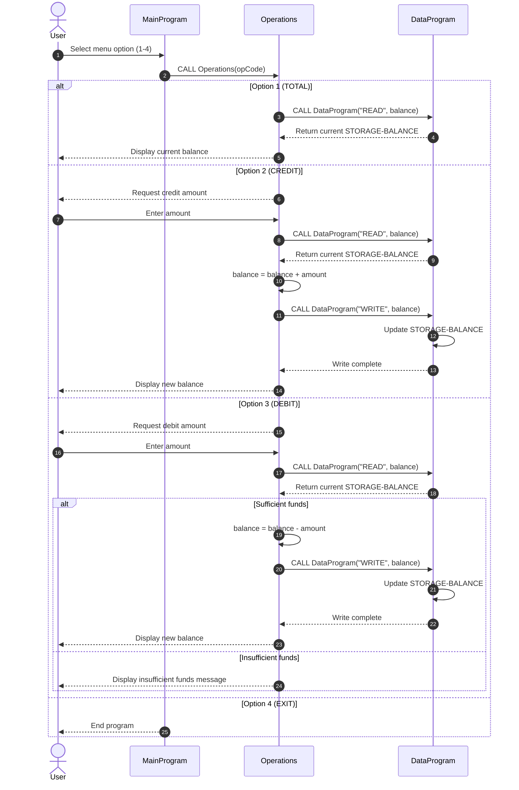

# Student Account COBOL Modules

This document describes the COBOL modules under [src/cobol](../src/cobol), their responsibilities, key routines, and business rules for student account handling.

## Overview

The system is split into three COBOL programs:

1. [main.cob](../src/cobol/main.cob): User interaction and menu loop.
2. [operations.cob](../src/cobol/operations.cob): Account operation logic (view, credit, debit).
3. [data.cob](../src/cobol/data.cob): Balance persistence abstraction (read/write).

The execution flow is:

1. Main menu receives user choice.
2. Main program calls `Operations` with an operation code.
3. `Operations` calls `DataProgram` to read or write the current balance.

## File-by-File Documentation

### [main.cob](../src/cobol/main.cob)

Purpose:
- Entry point of the account management application.
- Presents options and routes requests to the operations module.

Key functions:
- Displays a looped text menu:
  - 1: View balance
  - 2: Credit account
  - 3: Debit account
  - 4: Exit
- Calls `Operations` using one of these operation codes:
  - `TOTAL ` for balance inquiry
  - `CREDIT` for deposits/credits
  - `DEBIT ` for withdrawals/debits
- Handles invalid choices with an explicit message.

### [operations.cob](../src/cobol/operations.cob)

Purpose:
- Implements account transaction behavior.
- Coordinates reads/writes with the data module.

Key functions:
- `TOTAL ` path:
  - Calls `DataProgram` with `READ`.
  - Displays current balance.
- `CREDIT` path:
  - Accepts credit amount from user.
  - Reads current balance.
  - Adds amount to balance.
  - Persists updated balance using `WRITE`.
- `DEBIT ` path:
  - Accepts debit amount from user.
  - Reads current balance.
  - Checks available funds.
  - If sufficient, subtracts amount and writes updated balance.
  - If insufficient, displays rejection message and does not write.

### [data.cob](../src/cobol/data.cob)

Purpose:
- Encapsulates account balance storage and access.
- Exposes a simple read/write contract for other modules.

Key functions:
- Stores balance in `STORAGE-BALANCE` (initialized to `1000.00`).
- Supports `READ` operation:
  - Returns stored balance through linkage variable.
- Supports `WRITE` operation:
  - Updates stored balance from linkage variable.

## Business Rules for Student Accounts

1. Starting balance rule:
- Student accounts start with a default balance of `1000.00`.

2. Credit rule:
- Credits increase the account balance by the exact entered amount.

3. Debit rule:
- Debits are only allowed when current balance is greater than or equal to requested debit amount.
- If funds are insufficient, no balance update occurs.

4. Data access rule:
- All balance reads and writes must go through `DataProgram` (not directly from the UI program).

5. Operation code contract:
- Inter-program calls rely on fixed 6-character operation codes (`TOTAL `, `CREDIT`, `DEBIT `, `READ`, `WRITE`).
- Trailing spaces are significant for codes shorter than 6 characters.

## Notes and Current Constraints

1. Input validation is minimal:
- Numeric and business constraints (for example, non-negative amounts) are not explicitly enforced.

2. Persistence scope:
- Balance is maintained in program storage during runtime; there is no file or database persistence.

3. Single-account model:
- Current implementation behaves like one shared account balance, not multiple student records.

## Sequence Diagram (Data Flow)

